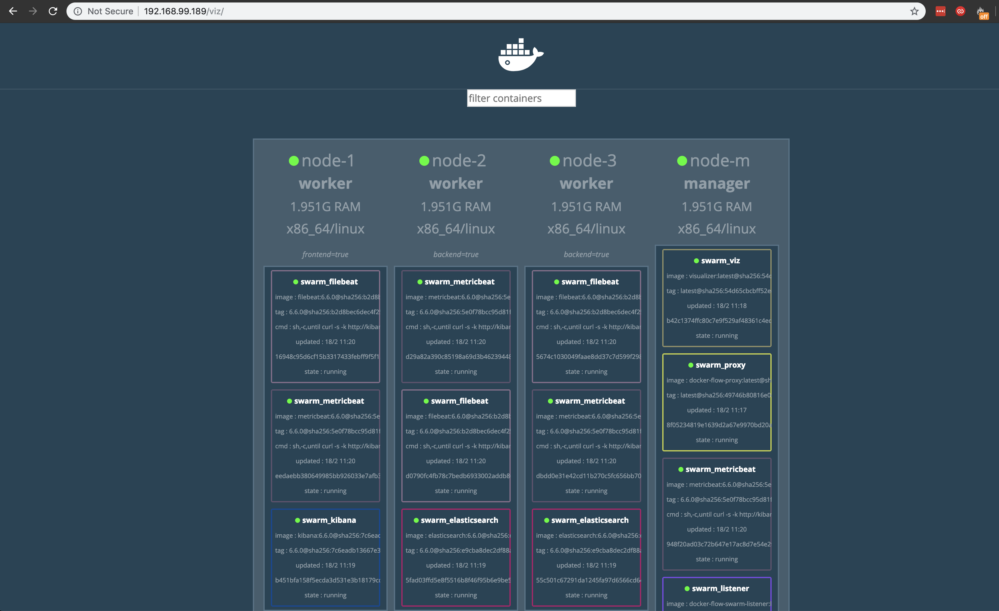
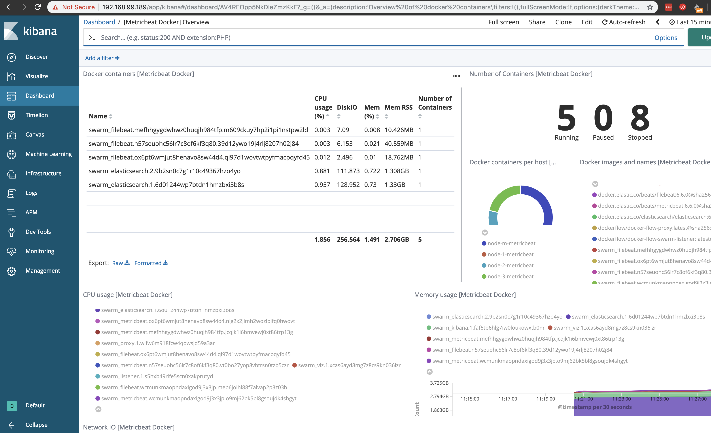

# beats-swarm

## Visualizations





## Usage

### node-up

```
$ make node-up
Creating virtualbox..
Running pre-create checks...
Creating machine...
(node-m) Copying /Users/luno/.docker/machine/cache/boot2docker.iso to /Users/luno/.docker/machine/machines/node-m/boot2docker.iso...
(node-m) Creating VirtualBox VM...
(node-m) Creating SSH key...
(node-m) Starting the VM...
(node-m) Check network to re-create if needed...
(node-m) Waiting for an IP...
...
Increating the limits on mmap..
vm.max_map_count = 1048575
vm.max_map_count = 1048575
vm.max_map_count = 1048575

>> The Swarm Cluster is set up!
```

### node-status

```
$ make node-status
ID                            HOSTNAME            STATUS              AVAILABILITY        MANAGER STATUS      ENGINE VERSION
rd8dl0gh6w59jl8v615vvolkx     node-1              Ready               Active                                  19.03.5
qlb141falll4lvfh4an0sydzb     node-2              Ready               Active                                  19.03.5
ildnkdnzqxlc1yiry4avsfe9g     node-3              Ready               Active                                  19.03.5
s4yfwil9raubyq7gy5vg3ki8f *   node-m              Ready               Active              Leader              19.03.5
```

### stack-start
```
$ make stack-start
Creating service swarm_fluent_bit
Creating service swarm_viz
Creating service swarm_listener
Creating service swarm_proxy
Creating service swarm_elasticsearch
Creating service swarm_kibana
Creating service swarm_apm_server
```

### stack-ps
```
$ make stack-ps
ID                          NAME                    IMAGE                                                                                                                         NODE                DESIRED STATE       CURRENT STATE                ERROR               PORTS
4j65m14x18jbsrh7j0qr592hh   swarm_apm_server.1      docker.elastic.co/apm/apm-server:7.6.0@sha256:d9812d400d3540d04c45460659a050d2064ba6fa264b05936ab0de9b47e004da                node-2              Running             Running about a minute ago                       
at3b8yw5qdae5pirikpq6nuzl   swarm_kibana.1          docker.elastic.co/kibana/kibana:7.6.0@sha256:2cb31b8d865b4ccc93ca72d4f23d338daacc06fb18dda8dec3f2e8e28e151743                 node-1              Running             Running 53 seconds ago                           
d21mlfk8famp17br5d9atety5   swarm_elasticsearch.1   docker.elastic.co/elasticsearch/elasticsearch:7.6.0@sha256:fb37d2e15d897b32bef18fed6050279f68a76d8c4ea54c75e37ecdbe7ca10b4b   node-3              Running             Running about a minute ago                       
ktzo4lsta3lvku6wh448i9ptq   swarm_proxy.1           dockerflow/docker-flow-proxy:latest@sha256:d51fcf532c3e4d5926c4743195ad700e517e5cb31a36fd0c46d9ac35853fd34e                   node-m              Running             Running about a minute ago                       
44ollbbah9rpu5u1pgbydj8te   swarm_listener.1        dockerflow/docker-flow-swarm-listener:latest@sha256:480b92ca36fe4326a97a5adbfbebdf56eefbb32b6e66cad6120a7e32492acadc          node-m              Running             Running about a minute ago                       
7q61uthjrutz94gdewsc4ik1e   swarm_viz.1             dockersamples/visualizer:latest@sha256:54d65cbcbff52ee7d789cd285fbe68f07a46e3419c8fcded437af4c616915c85                       node-m              Running             Running about a minute ago                       
axklfmuykncc2ilnzvqbatkzu   swarm_fluent_bit.1      fluent/fluent-bit:1.3@sha256:1402ed150af782796fccb5cbf4ea5056aad03cde3230bb6c730f1e4d21f13347                                 node-1              Running             Running 2 minutes ago                            
g5cc2cqypymhzmxabz4ivp3f2   swarm_elasticsearch.2   docker.elastic.co/elasticsearch/elasticsearch:7.6.0@sha256:fb37d2e15d897b32bef18fed6050279f68a76d8c4ea54c75e37ecdbe7ca10b4b   node-2              Running             Running about a minute ago                       
```

### stack-service
```
$ make stack-service
ID                  NAME                  MODE                REPLICAS            IMAGE                                                 PORTS
5wcgv41vcscd        swarm_elasticsearch   replicated          2/2                 docker.elastic.co/elasticsearch/elasticsearch:7.6.0   
66f754wze3kx        swarm_listener        replicated          1/1                 dockerflow/docker-flow-swarm-listener:latest          
b0t0rlj6zuqn        swarm_kibana          replicated          1/1                 docker.elastic.co/kibana/kibana:7.6.0                 
l3y5utxxv6ee        swarm_fluent_bit      replicated          1/1                 fluent/fluent-bit:1.3                                 
n1ityg1oh8j4        swarm_viz             replicated          1/1                 dockersamples/visualizer:latest                       
urd63l5szuf6        swarm_apm_server      replicated          1/1                 docker.elastic.co/apm/apm-server:7.6.0                
wfkkxugx8rwq        swarm_proxy           replicated          1/1                 dockerflow/docker-flow-proxy:latest                   *:80->80/tcp, *:443->443/tcp, *:8200->8200/tcp, *:9200->9200/tcp
```

### stack-logs


```
$ make stack-logs fluent_bit
swarm_fluent_bit.1.n59usrbj3sv8@node-1    | Fluent Bit v1.3.6
swarm_fluent_bit.1.n59usrbj3sv8@node-1    | Copyright (C) Treasure Data
swarm_fluent_bit.1.n59usrbj3sv8@node-1    |
swarm_fluent_bit.1.n59usrbj3sv8@node-1    | [2020/02/19 18:24:30] [ info] [storage] initializing...
swarm_fluent_bit.1.n59usrbj3sv8@node-1    | [2020/02/19 18:24:30] [ info] [storage] in-memory
swarm_fluent_bit.1.n59usrbj3sv8@node-1    | [2020/02/19 18:24:30] [ info] [storage] normal synchronization mode, checksum disabled, max_chunks_up=128
swarm_fluent_bit.1.n59usrbj3sv8@node-1    | [2020/02/19 18:24:30] [ info] [engine] started (pid=1)
swarm_fluent_bit.1.n59usrbj3sv8@node-1    | [2020/02/19 18:24:30] [ info] [http_server] listen iface=0.0.0.0 tcp_port=2020
swarm_fluent_bit.1.n59usrbj3sv8@node-1    | [2020/02/19 18:24:30] [ info] [sp] stream processor started
```

### stack-stop
```
$ make stack-stop
Removing service swarm_apm_server
Removing service swarm_elasticsearch
Removing service swarm_flog
Removing service swarm_fluent_bit
Removing service swarm_kibana
Removing service swarm_listener
Removing service swarm_proxy
Removing service swarm_viz
```

### node-down
```
$ make swarm-down
About to remove node-1
WARNING: This action will delete both local reference and remote instance.
Successfully removed node-1
About to remove node-2
WARNING: This action will delete both local reference and remote instance.
Successfully removed node-2
About to remove node-3
WARNING: This action will delete both local reference and remote instance.
Successfully removed node-3
About to remove node-m
WARNING: This action will delete both local reference and remote instance.
Successfully removed node-m
```

### node-cleanup
```
$ make node-cleanup
WARNING! This will remove all local volumes not used by at least one container.
Are you sure you want to continue? [y/N] Deleted Volumes:
swarm_kibana

Total reclaimed space: 113.8MB
WARNING! This will remove all local volumes not used by at least one container.
Are you sure you want to continue? [y/N] Deleted Volumes:
swarm_elasticsearch

Total reclaimed space: 141.9MB
WARNING! This will remove all local volumes not used by at least one container.
Are you sure you want to continue? [y/N] Deleted Volumes:
swarm_elasticsearch

Total reclaimed space: 141.6MB
WARNING! This will remove all local volumes not used by at least one container.
Are you sure you want to continue? [y/N] Deleted Volumes:
swarm_metricbeat
swarm_filebeat

Total reclaimed space: 1.7kB
```
